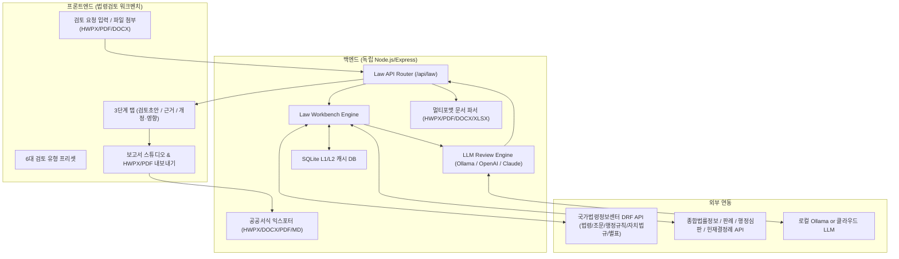
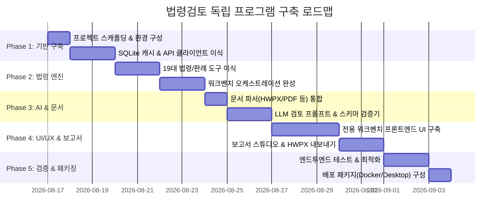

# [구현 계획서] 법령검토(Legal Review) 독립 프로그램 구축 계획

본 문서는 `myAI` 프로젝트 내에 통합되어 있는 **법령검토(Law Workbench)** 기능을 완벽하게 추출하여, 독립적으로 동작하는 고성능 **"AI 법령검토 & 법률 보고서 생성 전문 솔루션 (Legal Review Standalone)"**으로 구축하기 위한 아키텍처 분석 및 상세 구현 계획서입니다.

---

## 1. 개요 및 분석 요약

### 1.1 현재 myAI 프로젝트 내 법령검토 구조 분석
현재 프로젝트의 법령검토는 단순한 LLM 챗봇이 아니라, **국가법령정보센터(law.go.kr) 공식 Open API + 판례/결정례 API + 내부문서 파싱 + 지식베이스(KB) + RAG/LLM 합성 + 공공서식(HWPX/DOCX/PDF) 보고서 생성**이 결합된 고도화된 워크벤치 시스템입니다.



### 1.2 핵심 추출 대상 컴포넌트 매핑

| 구분 | myAI 원본 소스 파일 | 독립 프로그램 목적 및 역할 |
|---|---|---|
| **API 라우터** | `server/law/lawApi.js` | 법령 검색, 조문 조회, 워크벤치 실행, LLM 검토, 도구 실행 엔드포인트 |
| **API 클라이언트** | `server/law/lawApiClient.js`<br>`server/law/decisionsApiClient.js` | law.go.kr DRF API 및 판례/결정례 API 통신, 에러 핸들링, 보안 마스킹 |
| **파서 & 정규화** | `server/law/lawApiParser.js`<br>`server/law/decisionsApiParser.js`<br>`server/law/lawArticleRef.js` | XML/JSON 응답 정규화, 조문 번호(조·항·호·목) 파싱 및 인용 링크 생성 |
| **워크벤치 오케스트레이션** | `server/law/lawWorkbench.js` | 조문 + 별표 + 3단비교 + 자치법규 + 판례/해석례 + 내부영향 병렬 수집 |
| **LLM 검토 엔진** | `server/law/lawWorkbenchReview.js` | 수집된 공식근거 + 첨부문서를 바탕으로 10대 핵심 항목 구조화 JSON 생성 |
| **지식베이스 & 추론** | `server/law/lawTermKb.js`<br>`server/law/lawTopicHints.js`<br>`server/law/lawDiff.js` | 일상어-법률용어 매핑, 조문 추론, 개정 전후 조문 Diff 비교 |
| **도구 셋 (Tools)** | `server/law/tools/*.js` (19개 도구) | searchLaw, articleDetail, impactMap, timeTravel, lawStructure 등 |
| **캐시 시스템** | `server/law/lawCache.js` | SQLite 기반 7~30일 TTL 캐시 (트래픽 절감 및 고속 응답) |
| **문서 파싱** | `server/parsers.js` (문서 파서 부분) | HWPX, PDF, DOCX, XLSX, CSV, TXT, 이미지 파싱 |
| **보고서 익스포트** | `server/exportFiles.js`<br>`server/exportStyles.js` | HWPX, DOCX, PDF, XLSX, Markdown 표준 공공서식 파일 생성 |
| **프론트엔드 UI** | `public/modules/lawWorkbench.js`<br>`public/modules/documentStudio.js` (경량화)<br>`public/styles.css` (법령 특화) | 법령 워크벤치 전용 UI, 3단계 탭, 실시간 근거 뷰어, 보고서 에디터 |

---

## 2. 사용자 검토 및 결정 권장 사항

1. **백엔드 및 프론트엔드 기술 스택 선정**
   - **옵션 A (경량 일체형 - 추천)**: Node.js (Express) + Vanilla JS / Modern ES Modules + SQLite (기존 코드 100% 호환, 가장 가볍고 배포 간편).
   - **옵션 B (모던 SPA 분리형)**: FastAPI (Python) or Express (Node.js) + React / Vite + TailwindCSS.
   - **옵션 C (데스크톱 설치형 앱)**: Electron 또는 Tauri로 패키징하여 오프라인/로컬 단독 실행 프로그램으로 배포.

2. **LLM 서빙 방식 결정**
   - **로컬 LLM (보안 최우선)**: Ollama (gemma4, qwen2.5, llama3 등) 연동.
   - **클라우드 LLM**: OpenAI (GPT-4o), Anthropic (Claude 3.5 Sonnet), Google (Gemini 2.5 Flash/Pro) API 선택형 연동.
   - **하이브리드**: 설정 화면에서 로컬/클라우드 전환 가능하도록 구성 (추천).

3. **외부 API Key 준비 사항**
   - 국가법령정보센터(law.go.kr) 오픈API 인증키 (`LAW_OC`)
   - 판례/행정심판/헌재 결정례 오픈API 인증키 (`DECISIONS_API_KEY` / `HUNZAE_API_KEY`)

---

## 3. 새로운 독립 프로젝트 디렉토리 구조 (Directory Layout)

신규 프로젝트명: `legal-reviewer` (가칭)

```text
legal-reviewer/
├── .env.example                     # 환경변수 템플릿 (LAW_OC, OLLAMA_URL 등)
├── package.json                     # 의존성 정의
├── server/
│   ├── index.js                     # 경량 Express 메인 서버
│   ├── env.js                       # 환경변수 로더 및 유효성 검증
│   ├── abort.js                     # 비동기 요청 취소 컨트롤러
│   ├── rateLimit.js                 # API Rate Limiter
│   ├── parsers/                     # 첨부문서 파서
│   │   ├── index.js                 # 멀티포맷 파서 진입점
│   │   ├── hwpxParser.js            # HWPX 파서 (XML 파싱)
│   │   ├── pdfParser.js             # PDF 파서 (pdf-parse)
│   │   ├── docxParser.js            # DOCX 파서 (mammoth)
│   │   └── excelParser.js           # XLSX/CSV 파서
│   ├── law/                         # 법령 검토 핵심 엔진
│   │   ├── lawApi.js                # 법령 라우터 (/api/law)
│   │   ├── lawApiClient.js          # law.go.kr 연동 클라이언트
│   │   ├── lawApiParser.js          # 법령 XML/JSON 응답 파서
│   │   ├── decisionsApiClient.js    # 판례/결정례 API 클라이언트
│   │   ├── decisionsApiParser.js    # 판례/결정례 파서
│   │   ├── lawWorkbench.js          # 법령 워크벤치 오케스트레이터
│   │   ├── lawWorkbenchReview.js    # LLM 법령검토 추론기 (JSON 스키마 보장)
│   │   ├── lawTermKb.js             # 법률 용어 KB
│   │   ├── lawArticleRef.js         # 조문 인용 파서
│   │   ├── lawCache.js              # SQLite 법령 캐시
│   │   ├── lawConfig.js             # 법령 설정 관리
│   │   ├── lawErrors.js             # 에러 핸들러
│   │   ├── lawDiff.js               # 조문 개정 비교 엔진
│   │   └── tools/                   # 19개 법령 조회 도구 모음
│   │       ├── searchLaw.js, searchAiLaw.js, articleDetail.js, ...
│   │       ├── precedents.js, interpretations.js, adminRules.js, ordinances.js, ...
│   │       └── toolRegistry.js, toolRunner.js
│   └── export/                      # 보고서 내보내기 엔진
│       ├── exportFiles.js           # HWPX, DOCX, PDF, XLSX, MD 생성기
│       └── exportStyles.js          # 공공기관 공문서/보고서 서식 프로필
├── public/                          # 프론트엔드 SPA
│   ├── index.html                   # 법령검토 단독 UI 페이지
│   ├── css/
│   │   ├── main.css                 # 메인 레이아웃 및 테마
│   │   ├── workbench.css            # 워크벤치, 3단 탭, 조문 뷰어 스타일
│   │   └── studio.css               # 보고서 편집기 및 인용 마크다운 스타일
│   ├── js/
│   │   ├── app.js                   # 프론트엔드 진입점 및 라우팅
│   │   ├── lawWorkbench.js          # 워크벤치 UI 컨트롤러
│   │   ├── documentStudio.js        # 보고서 에디터 및 내보내기 UI
│   │   ├── documentViewer.js        # 조문/판례/별표 상세 모달 뷰어
│   │   └── state.js                 # 세션 및 로컬 상태 관리 (IndexedDB)
│   └── assets/                      # 아이콘, 로고 등
└── data/
    └── cache/                       # SQLite 캐시 저장 경로
```

---

## 4. 단계별 상세 구현 로드맵 (Phased Roadmap)



### Phase 1: 백엔드 코어 및 법령 API 연동 계층 구축
1. **독립 Node.js 패키지 초기화**:
   - 필수 패키지: `express`, `better-sqlite3`, `fast-xml-parser`, `jszip`, `pdf-parse`, `mammoth`, `pdfkit`, `dotenv`
2. **설정 및 보안 모듈 (`lawConfig.js`, `lawErrors.js`, `abort.js`)**:
   - `LAW_OC`, `DECISIONS_API_KEY`, `OLLAMA_URL` 등 환경변수 로딩 및 에러 처리.
   - 키 마스킹(`maskLawSecrets`)으로 로그상 API Key 유출 방지.
3. **SQLite 캐시 엔진 (`lawCache.js`)**:
   - 법령 본문(7일), 개정이력/판례(30일), 검색(1일) 등 유효기간 기반 캐싱 및 동시성 락 제어.
4. **법제처 & 판례 OpenAPI 클라이언트 (`lawApiClient.js`, `decisionsApiClient.js`)**:
   - DRF API 요청(JSON/XML), 타임아웃, 재시도, Rate Limiting.

### Phase 2: 19대 법령 도구 및 종합 워크벤치 오케스트레이터 구축
1. **19개 법령 세부 도구 이식 (`server/law/tools/`)**:
   - `searchLaw`, `searchAiLaw`, `articleDetail`, `articleAt`, `articleDiff`, `lawHistory`, `lawStructure`, `delegatedLaws`, `linkedOrdinances`, `annexes`, `precedents`, `interpretations`, `adminRules`, `decisions`, `impactMap`, `timeTravel`, `verifyCitations`
2. **종합 워크벤치 엔진 (`lawWorkbench.js`)**:
   - 질의어/법령명 입력 시 일상어-법률용어 확장(`lawTermKb.js`) -> AI 후보 검색 -> 조문 자동 식별 -> 별표/법체계(3단)/자치법규/판례/해석례 병렬 조회 -> 내부문서 영향분석(ImpactMap) 통합 데이터 구조 생성.

### Phase 3: 첨부문서 파싱 & LLM 법령검토 파이프라인
1. **공공 문서 멀티포맷 파서 (`parsers/`)**:
   - HWPX (한글 문서의 XML 파싱 및 본문/표 추출)
   - PDF (텍스트 및 조항 레이아웃 추출)
   - DOCX, XLSX, CSV, TXT, 이미지
2. **LLM 구조화 검토 엔진 (`lawWorkbenchReview.js`)**:
   - Ollama / OpenAI / Claude 모델 연동.
   - 10대 법령 검토 스키마 적용 (요약, 핵심쟁점, 사실관계, 법령근거, 검토의견, 리스크, 보완권고, 추가확인사항, 초안의견, 면책고지).
   - Strict JSON 모드 및 폴백 파서(`parseJson`, `normalizeReviewResult`).

### Phase 4: 법령검토 전문 독립 프론트엔드 UI/UX
1. **단독 워크벤치 화면 (`index.html`, `workbench.css`)**:
   - **Hero Search Bar**: 6대 검토 유형 드롭다운 + 질문 입력 + HWPX/PDF 드래그앤드롭 첨부.
   - **3단계 업무 탭**:
     1. `[검토 초안]` : 핵심 요약, 쟁점, 리스크, 보완 권고, 검토의견서 초안
     2. `[공식 근거]` : 공식 조문 본문, 별표/서식, 3단 법체계, 자치법규, 판례/해석례/행정규칙
     3. `[개정/영향]` : 법령 개정 이력(타임트래블), 내부 문서 조문 충돌 신호
   - **조문/판례 딥뷰어 모달**: 법제처 원문 링크 및 전문 팝업.
2. **보고서 스튜디오 & 에디터 (`documentStudio.js`)**:
   - 검토 결과 원클릭 보고서 변환 (`/api/law/workbench/report`).
   - 마크다운 실시간 렌더링, 인용 번호 자동 각주 연결, 수정/편집.

### Phase 5: HWPX/DOCX/PDF 공공서식 보고서 내보내기
1. **공공기관 표준 스타일 프로필 (`exportStyles.js`)**:
   - 문서 유형별(검토의견서, 자치법규 검토서, 민원회신서, 처분근거서) 폰트, 여백, 표 서식.
2. **멀티포맷 익스포터 (`exportFiles.js`)**:
   - **HWPX**: 한글 2014 이상 완벽 호환 (Zip 압축 내 Contents/section0.xml 생성).
   - **DOCX**: MS Word OpenXML 서식.
   - **PDF**: 인쇄용 PDFKit 한글 폰트 임베딩.
   - **Markdown / XLSX**: 텍스트 및 데이터 추출.

### Phase 6: 테스트, 검증 및 패키징
1. **엔드투엔드 시나리오 검증**:
   - 시나리오 1: 법령명 + 조문 직접 검토 (예: 도로교통법 제15조)
   - 시나리오 2: 자연어 질문 + HWPX 문서 첨부 검토 (예: 민원 답변 적법성)
   - 시나리오 3: 조례 상위법 충돌 검토 (예: 서울시 조례 vs 상위 모법)
2. **배포 옵션**:
   - **Docker 배포**: `Dockerfile` + `compose.yml` (Ollama 컨테이너와 원클릭 연동)
   - **로컬 실행 스크립트**: `run.bat` / `run.sh`
   - **(선택) Electron 패키징**: 데스크톱 단독 앱 (`npm run dist`)

---

## 5. 검증 계획 (Verification Plan)

### 5.1 자동화 단위 및 통합 테스트
- 법제처 API 연동 테스트: `test/lawApi.test.js`
- 조문 인용 파서 테스트: `test/lawArticleRef.test.js`
- HWPX/PDF 문서 파서 테스트: `test/parsers.test.js`
- 워크벤치 데이터 빌드 및 LLM JSON 스키마 테스트: `test/lawWorkbench.test.js`
- HWPX/DOCX/PDF 내보내기 파일 생성 무결성 검증

### 5.2 사용자 매뉴얼 검증
- 브라우저에서 `http://localhost:3000` 접속 후 6대 검토 유형별 정상 작동 확인
- HWPX/PDF 파일 첨부 후 검토 결과 생성 및 HWPX 보고서 다운로드 후 한글 프로그램에서 정상 열림 확인
